# Local Development Guide

This guide provides comprehensive information about local development workflows for the TriviaNFT project. It covers daily workflows, tool selection, and best practices for efficient development.

## Table of Contents

- [Overview](#overview)
- [Development Tools](#development-tools)
- [When to Use Which Tool](#when-to-use-which-tool)
- [Daily Workflows](#daily-workflows)
- [Vercel Dev Detailed Guide](#vercel-dev-detailed-guide)
- [Metro/Expo Guide](#metroexpo-guide)
- [Testing Workflows](#testing-workflows)
- [Expected Behavior](#expected-behavior)
- [Performance Considerations](#performance-considerations)
- [Best Practices](#best-practices)
- [Troubleshooting](#troubleshooting)

## Overview

The TriviaNFT project supports two development environments:

1. **Vercel Dev** (Primary) - Full-stack development with production parity
2. **Metro/Expo** (Optional) - Rapid UI iteration only

**Default Choice:** Use Vercel Dev for all development and testing. Only use Metro/Expo when you need extremely fast hot reload for UI-only work.

## Development Tools

### Vercel Dev (Primary Tool)

**What it is:** A local development server that runs your Next.js application with the same runtime environment as production.

**What works:**
- ✅ All Next.js pages and routes
- ✅ API routes (serverless functions)
- ✅ Environment variables from `.env.local`
- ✅ Inngest workflow integration
- ✅ Database connections
- ✅ Redis caching
- ✅ Production-like behavior
- ✅ Hot reload (with browser refresh)

**What doesn't work:**
- ❌ Instant hot reload (requires browser refresh)
- ❌ React Native mobile preview

**Startup time:**
- First time: 30-60 seconds
- Subsequent: 10-20 seconds

**Port:** http://localhost:3000

**Command:**
```bash
cd apps/web
vercel dev
```

### Metro/Expo (Optional Tool)

**What it is:** The JavaScript bundler used by Expo for React Native development with instant hot reload.

**What works:**
- ✅ Instant hot reload (no browser refresh)
- ✅ React Native mobile preview
- ✅ Fast UI iteration
- ✅ Component development

**What doesn't work:**
- ❌ API routes (will fail)
- ❌ Serverless functions
- ❌ Inngest workflows
- ❌ Production-like behavior
- ❌ Environment variables (limited support)

**Startup time:**
- First time: 5-10 seconds
- Subsequent: 3-5 seconds

**Port:** http://localhost:8081

**Command:**
```bash
cd apps/web
pnpm dev:ui
```

## When to Use Which Tool

### Decision Matrix

| Scenario | Tool | Reason |
|----------|------|--------|
| **API route development** | Vercel Dev | API routes only work in Vercel Dev |
| **Testing before commit** | Vercel Dev | Must verify production-like behavior |
| **E2E test development** | Vercel Dev | Tests run against Vercel Dev |
| **Database integration** | Vercel Dev | Database connections work properly |
| **Inngest workflow testing** | Vercel Dev | Workflows only work in Vercel Dev |
| **Full-stack feature work** | Vercel Dev | Need both frontend and backend |
| **Rapid UI prototyping** | Metro/Expo | Instant hot reload speeds up iteration |
| **Component styling** | Metro/Expo | Fast feedback for visual changes |
| **Layout adjustments** | Metro/Expo | Quick iteration on responsive design |

### Decision Flowchart

```
┌─────────────────────────────────────┐
│   What are you working on?          │
└─────────────────────────────────────┘
                 │
                 ▼
    ┌────────────────────────┐
    │  Does it involve       │
    │  API routes or         │───Yes──▶ Use Vercel Dev
    │  backend logic?        │
    └────────────────────────┘
                 │
                 No
                 │
                 ▼
    ┌────────────────────────┐
    │  Are you about to      │
    │  commit or run         │───Yes──▶ Use Vercel Dev
    │  tests?                │
    └────────────────────────┘
                 │
                 No
                 │
                 ▼
    ┌────────────────────────┐
    │  Do you need instant   │
    │  hot reload for        │───Yes──▶ Use Metro/Expo
    │  UI iteration?         │         (but test with
    └────────────────────────┘          Vercel Dev later!)
                 │
                 No
                 │
                 ▼
         Use Vercel Dev
         (default choice)
```

### Quick Reference

**Use Vercel Dev when:**
- Working on API routes
- Testing database queries
- Developing Inngest workflows
- Running E2E tests
- Preparing to commit code
- Need production parity
- Working on full-stack features

**Use Metro/Expo when:**
- Rapidly iterating on UI components
- Adjusting styles and layouts
- Prototyping new screens
- Need instant visual feedback
- Working on UI-only features

**Always remember:** Test with Vercel Dev before committing, even if you developed with Metro/Expo!

## Daily Workflows

### Workflow 1: Morning UI Work

**Scenario:** You're starting the day working on UI components and styling.

```bash
# Terminal 1: Start Metro for fast iteration
cd apps/web
pnpm dev:ui

# Work on UI components with instant hot reload
# Make changes to components in src/components/
# See changes instantly without browser refresh
```

**When to switch to Vercel Dev:**
- Before lunch break (verify everything still works)
- Before committing changes
- When you need to test API integration

```bash
# Stop Metro (Ctrl+C)
# Start Vercel Dev
vercel dev

# Test your changes in production-like environment
# Run E2E tests if needed
pnpm test:e2e
```

### Workflow 2: Afternoon API Testing

**Scenario:** After lunch, you're working on API routes and backend logic.

```bash
# Terminal 1: Start Vercel Dev
cd apps/web
vercel dev

# Terminal 2: Start Inngest Dev Server (if testing workflows)
npx inngest-cli@latest dev

# Terminal 3: Run tests as you develop
pnpm test:unit        # Quick unit tests
pnpm test:e2e         # Full E2E tests

# Make changes to API routes in app/api/
# Test endpoints with curl or browser
curl http://localhost:3000/api/health
```

### Workflow 3: Full-Stack Feature Development

**Scenario:** You're building a complete feature that involves both UI and API.

```bash
# Terminal 1: Start Vercel Dev (keep it running all day)
cd apps/web
vercel dev

# Terminal 2: Start Inngest Dev Server
npx inngest-cli@latest dev

# Terminal 3: Run tests frequently
pnpm test:unit        # After each logical change
pnpm test:e2e         # Before committing

# Develop feature incrementally:
# 1. Build API route
# 2. Test API route with curl
# 3. Build UI component
# 4. Test integration
# 5. Run E2E tests
# 6. Commit
```

### Workflow 4: Bug Fix

**Scenario:** You need to fix a bug reported in production.

```bash
# Always use Vercel Dev for bug fixes
cd apps/web
vercel dev

# Reproduce the bug locally
# Write a failing test first (TDD approach)
# Fix the bug
# Verify test passes
pnpm test:e2e

# Commit the fix
git add .
git commit -m "fix: resolve issue with X"
```

### Workflow 5: Pre-Commit Verification

**Scenario:** You've made changes and want to ensure everything works before committing.

```bash
# Ensure Vercel Dev is running
cd apps/web
vercel dev

# Run complete verification
pnpm verify           # Runs unit + E2E tests

# If all tests pass:
git add .
git commit -m "feat: add new feature"
git push

# If tests fail:
# Fix issues and run verify again
```

## Vercel Dev Detailed Guide

### Starting Vercel Dev

```bash
# Navigate to web app
cd apps/web

# Start Vercel Dev
vercel dev

# Expected output:
# Vercel CLI 33.0.0
# > Ready! Available at http://localhost:3000
```

### First-Time Startup

The first time you run Vercel Dev (or after clearing cache), expect:

1. **Building application** (20-30 seconds)
   - Compiling TypeScript
   - Building Next.js pages
   - Initializing serverless functions

2. **Starting server** (5-10 seconds)
   - Loading environment variables
   - Connecting to services
   - Starting development server

3. **Ready to use** (total: 30-60 seconds)

### Subsequent Startups

After the first run, Vercel Dev caches build artifacts:

1. **Loading cache** (5-10 seconds)
2. **Starting server** (5-10 seconds)
3. **Ready to use** (total: 10-20 seconds)

### Hot Reload Behavior

Vercel Dev supports hot reload, but it's different from Metro:

**File Changes:**
- Save a file → Vercel rebuilds → Refresh browser to see changes
- Typically takes 2-5 seconds for rebuild
- Browser refresh is required (not automatic)

**API Route Changes:**
- Save API route file → Vercel rebuilds function → Test endpoint
- No browser refresh needed for API testing
- Use curl or Postman to test

**Environment Variable Changes:**
- Changes to `.env.local` require restart
- Stop Vercel Dev (Ctrl+C) and start again

### Keeping Vercel Dev Running

**Best practice:** Keep Vercel Dev running throughout your development session.

**Benefits:**
- Faster iteration (no startup time)
- Consistent environment
- E2E tests can reuse existing server

**When to restart:**
- After changing `.env.local`
- After installing new dependencies
- If you encounter strange errors
- At the start of each day (fresh start)

### Testing with Vercel Dev

```bash
# Terminal 1: Keep Vercel Dev running
vercel dev

# Terminal 2: Run tests
pnpm test:unit        # Unit tests (fast)
pnpm test:e2e         # E2E tests (slower)
pnpm test:e2e:ui      # E2E tests with UI
pnpm verify           # All tests

# Test specific API routes
curl http://localhost:3000/api/health
curl http://localhost:3000/api/categories
```

### Vercel Dev with Inngest

For testing Inngest workflows locally:

```bash
# Terminal 1: Start Inngest Dev Server
npx inngest-cli@latest dev
# Opens at http://localhost:8288

# Terminal 2: Start Vercel Dev
cd apps/web
vercel dev

# Terminal 3: Trigger workflows
npx tsx inngest/test-workflows.ts

# View workflow execution in Inngest UI
# Open http://localhost:8288 in browser
```

### Vercel Dev Configuration

Vercel Dev reads configuration from:

1. **vercel.json** - Project configuration
2. **.env.local** - Environment variables
3. **.vercel/** - Project link information

**Custom port:**
```bash
vercel dev --listen 3001
```

**Debug mode:**
```bash
vercel dev --debug
```

## Hot Reload Behavior and Workarounds

### Understanding Hot Reload Differences

Hot reload is a critical feature for developer productivity, but it works differently between Vercel Dev and Metro. Understanding these differences will help you choose the right tool for each task and avoid frustration.

### Vercel Dev Hot Reload

**How it works:**
1. You save a file
2. Vercel Dev detects the change
3. Next.js rebuilds the affected modules (2-5 seconds)
4. **You must manually refresh the browser** to see changes
5. Application state is lost on refresh

**Example workflow:**
```bash
# Terminal: Vercel Dev running
vercel dev

# 1. Edit src/components/Button.tsx
# 2. Save file (Ctrl+S or Cmd+S)
# 3. Wait for "Compiled successfully" message in terminal (2-5 sec)
# 4. Switch to browser
# 5. Press F5 or Ctrl+R to refresh
# 6. See your changes
```

**Pros:**
- ✅ Works with full Next.js stack
- ✅ API routes reload automatically
- ✅ Production-like behavior
- ✅ Environment variables available

**Cons:**
- ❌ Requires manual browser refresh
- ❌ Slower rebuild (2-5 seconds)
- ❌ Application state is lost
- ❌ Not ideal for rapid iteration

### Metro Hot Reload

**How it works:**
1. You save a file
2. Metro detects the change
3. Metro rebuilds the affected modules (< 1 second)
4. **Changes appear automatically** in browser/app
5. Component state is often preserved (Fast Refresh)

**Example workflow:**
```bash
# Terminal: Metro running
pnpm dev:ui

# 1. Edit src/components/Button.tsx
# 2. Save file (Ctrl+S or Cmd+S)
# 3. Changes appear instantly in browser (< 1 sec)
# 4. Component state is preserved
# 5. Continue working without interruption
```

**Pros:**
- ✅ Instant feedback (< 1 second)
- ✅ No manual refresh needed
- ✅ Component state preserved
- ✅ Ideal for rapid iteration

**Cons:**
- ❌ API routes don't work
- ❌ No serverless functions
- ❌ Limited environment variables
- ❌ Not production-like

### When to Use Metro for Rapid UI Iteration

Metro is ideal for these specific scenarios:

#### 1. Component Styling and Layout

**Use Metro when:**
- Adjusting colors, fonts, spacing
- Tweaking responsive layouts
- Fine-tuning animations
- Experimenting with visual designs

**Example:**
```bash
# Start Metro for rapid iteration
pnpm dev:ui

# Make many small changes to styling
# See each change instantly
# No need to refresh browser
# Component state preserved between changes
```

#### 2. UI Component Development

**Use Metro when:**
- Building new UI components
- Prototyping component interactions
- Testing different component states
- Developing component libraries

**Example:**
```bash
# Developing a new Card component
pnpm dev:ui

# Iterate quickly on:
# - Component structure
# - Props interface
# - Visual appearance
# - Hover states
# - Click interactions
```

#### 3. Visual Prototyping

**Use Metro when:**
- Creating mockups
- Exploring design ideas
- Testing user flows (UI only)
- Building proof-of-concepts

**Important:** Always switch to Vercel Dev before integrating with backend!

### Workflow for Switching Between Tools

#### Scenario 1: UI Work → Backend Integration

**Step 1: Rapid UI iteration with Metro**
```bash
# Terminal 1: Start Metro
cd apps/web
pnpm dev:ui

# Work on UI components
# Iterate quickly with instant hot reload
# Get the UI looking perfect
```

**Step 2: Switch to Vercel Dev for integration**
```bash
# Stop Metro (Ctrl+C)

# Start Vercel Dev
vercel dev

# Now integrate with API routes
# Test full-stack functionality
# Run E2E tests
pnpm test:e2e
```

**Step 3: Verify before committing**
```bash
# Ensure Vercel Dev is still running
# Run complete verification
pnpm verify

# If all tests pass, commit
git add .
git commit -m "feat: add new card component with API integration"
```

#### Scenario 2: Morning UI, Afternoon API

**Morning: UI development**
```bash
# 9:00 AM - Start Metro for UI work
pnpm dev:ui

# Work on styling and components
# Fast iteration with instant feedback
# Get UI components ready
```

**Lunch: Switch to Vercel Dev**
```bash
# 12:00 PM - Stop Metro, start Vercel Dev
# Ctrl+C to stop Metro
vercel dev

# Verify UI still works in production-like environment
# Test in browser at http://localhost:3000
```

**Afternoon: API development**
```bash
# 1:00 PM - Vercel Dev already running
# Work on API routes
# Test endpoints
# Integrate UI with backend
# Run tests frequently
pnpm test:unit
```

**End of day: Final verification**
```bash
# 5:00 PM - Complete verification
pnpm verify

# Commit if all tests pass
git commit -m "feat: complete feature X"
```

#### Scenario 3: Quick Style Fix

**For small styling changes:**
```bash
# Option A: Use Metro for instant feedback
pnpm dev:ui
# Make change, see it instantly
# Stop Metro, start Vercel Dev
vercel dev
# Verify and commit

# Option B: Use Vercel Dev directly
vercel dev
# Make change, refresh browser
# Verify and commit
# (Slower but simpler workflow)
```

**Choose Option A when:**
- Making multiple small adjustments
- Need to see many iterations quickly
- Working on complex styling

**Choose Option B when:**
- Making a single small change
- Already have Vercel Dev running
- Want simpler workflow

### Vercel Dev Testing is Required Before Committing

**Critical Rule:** Always test with Vercel Dev before committing code, regardless of which tool you used for development.

#### Why This Matters

**Problem:** Code works in Metro but fails in production
```bash
# Developer workflow (WRONG):
pnpm dev:ui              # Develop with Metro
# ... make changes ...
git commit -m "feat: add feature"
git push

# Production deployment:
# ❌ API routes fail
# ❌ Environment variables missing
# ❌ Serverless functions don't work
# ❌ Users see broken features
```

**Solution:** Always verify with Vercel Dev
```bash
# Developer workflow (CORRECT):
pnpm dev:ui              # Develop with Metro (optional)
# ... make changes ...

# STOP! Switch to Vercel Dev
vercel dev               # Test in production-like environment
pnpm verify              # Run all tests

# Only commit if tests pass
git commit -m "feat: add feature"
git push

# Production deployment:
# ✅ Everything works
# ✅ Users happy
```

#### Pre-Commit Checklist

Before committing any code, verify:

- [ ] Vercel Dev is running (not Metro)
- [ ] Application loads at http://localhost:3000
- [ ] All features work as expected
- [ ] Unit tests pass: `pnpm test:unit`
- [ ] E2E tests pass: `pnpm test:e2e`
- [ ] No console errors in browser
- [ ] API routes respond correctly
- [ ] Environment variables load properly

**Quick verification command:**
```bash
# One command to verify everything
pnpm verify

# If this passes, you're good to commit
git commit -m "feat: add feature"
```

#### Common Mistakes to Avoid

**Mistake 1: Committing Metro-only code**
```bash
# WRONG:
pnpm dev:ui
# ... develop feature ...
git commit -m "feat: add feature"
# Never tested with Vercel Dev!
```

**Mistake 2: Skipping tests**
```bash
# WRONG:
vercel dev
# ... develop feature ...
# Looks good in browser
git commit -m "feat: add feature"
# Never ran pnpm verify!
```

**Mistake 3: Testing only in browser**
```bash
# WRONG:
vercel dev
# ... develop feature ...
# Manually test in browser
# Looks good!
git commit -m "feat: add feature"
# Never ran automated tests!
```

**Correct workflow:**
```bash
# RIGHT:
pnpm dev:ui              # Optional: rapid UI iteration
vercel dev               # Required: production-like testing
pnpm verify              # Required: automated tests
git commit -m "feat: add feature"  # Only if verify passes
```

### Hot Reload Workarounds and Tips

#### Tip 1: Use Browser DevTools for Quick CSS Changes

Instead of editing files for small CSS tweaks:

```bash
# 1. Open browser DevTools (F12)
# 2. Edit CSS directly in DevTools
# 3. See changes instantly
# 4. Once satisfied, copy CSS to your files
# 5. Refresh to verify
```

This works with both Vercel Dev and Metro.

#### Tip 2: Keep Both Terminals Ready

Set up your terminal for quick switching:

```bash
# Terminal 1: Vercel Dev (keep running)
cd apps/web
vercel dev

# Terminal 2: Metro (start when needed)
cd apps/web
pnpm dev:ui

# Switch between them by:
# - Stopping Metro (Ctrl+C)
# - Using Vercel Dev at :3000
# Or vice versa
```

#### Tip 3: Use Browser Auto-Refresh Extensions

For Vercel Dev, use browser extensions that auto-refresh:

- **Chrome:** "Auto Refresh Plus"
- **Firefox:** "Auto Reload"
- **Edge:** "Auto Refresh"

Configure to refresh every 3-5 seconds while developing.

**Note:** This is a workaround. Metro's built-in hot reload is still faster.

#### Tip 4: Organize Work by Tool Requirements

Plan your day around tool requirements:

**Morning (Metro-friendly):**
- UI component development
- Styling and layout
- Visual design work
- Component prototyping

**Afternoon (Vercel Dev required):**
- API route development
- Backend integration
- Database work
- Inngest workflows
- Testing and verification

#### Tip 5: Use Component Storybooks

For component development, consider using Storybook:

```bash
# Install Storybook (if not already installed)
npx storybook@latest init

# Run Storybook
pnpm storybook

# Develop components in isolation
# Instant hot reload
# No need for Metro or Vercel Dev
```

Storybook provides instant hot reload for component development without the limitations of Metro.

### Decision Matrix: Which Tool for Hot Reload?

| Task | Best Tool | Reason |
|------|-----------|--------|
| **Adjusting button colors** | Metro | Instant feedback needed |
| **Testing API endpoint** | Vercel Dev | API routes only work here |
| **Tweaking responsive layout** | Metro | Many small iterations |
| **Integrating with database** | Vercel Dev | Database connection needed |
| **Prototyping new screen** | Metro | Fast visual iteration |
| **Testing Inngest workflow** | Vercel Dev | Workflows only work here |
| **Fine-tuning animations** | Metro | Need instant feedback |
| **Running E2E tests** | Vercel Dev | Tests require production parity |
| **Experimenting with designs** | Metro | Rapid iteration needed |
| **Pre-commit verification** | Vercel Dev | Must test production-like |

### Summary: Hot Reload Best Practices

1. **Understand the trade-offs**
   - Metro: Fast iteration, limited functionality
   - Vercel Dev: Full functionality, slower iteration

2. **Use the right tool for the job**
   - Metro for rapid UI iteration
   - Vercel Dev for everything else

3. **Always verify with Vercel Dev**
   - Before committing
   - Before pushing
   - Before deploying

4. **Plan your workflow**
   - Group Metro-friendly tasks together
   - Switch to Vercel Dev for integration
   - End day with Vercel Dev verification

5. **Don't skip testing**
   - Run `pnpm verify` before committing
   - Automated tests catch issues manual testing misses
   - Production parity prevents deployment surprises

**Remember:** Fast iteration is great, but correct code is essential. Always test with Vercel Dev before committing!

## Developer Workflow Diagram

The following diagram illustrates the complete developer workflow, including decision points for tool selection, testing integration, and deployment process.

```mermaid
flowchart TD
    Start([Start Development Task]) --> TaskType{What type of task?}
    
    TaskType -->|UI Only| UIDecision{Need instant<br/>hot reload?}
    TaskType -->|API/Backend| UseVercel[Use Vercel Dev]
    TaskType -->|Full-Stack| UseVercel
    TaskType -->|Bug Fix| UseVercel
    
    UIDecision -->|Yes, rapid iteration| UseMetro[Use Metro/Expo]
    UIDecision -->|No| UseVercel
    
    UseMetro --> MetroDev[Start Metro: pnpm dev:ui]
    MetroDev --> IterateUI[Iterate on UI<br/>Instant hot reload]
    IterateUI --> UIComplete{UI work<br/>complete?}
    UIComplete -->|No| IterateUI
    UIComplete -->|Yes| StopMetro[Stop Metro]
    StopMetro --> UseVercel
    
    UseVercel --> VercelDev[Start Vercel Dev: vercel dev]
    VercelDev --> Develop[Develop Feature<br/>Manual browser refresh]
    
    Develop --> NeedInngest{Need Inngest<br/>workflows?}
    NeedInngest -->|Yes| StartInngest[Start Inngest Dev Server<br/>npx inngest-cli dev]
    NeedInngest -->|No| TestUnit
    StartInngest --> TestUnit
    
    TestUnit[Run Unit Tests<br/>pnpm test:unit]
    TestUnit --> UnitPass{Tests pass?}
    UnitPass -->|No| FixUnit[Fix Issues]
    FixUnit --> TestUnit
    UnitPass -->|Yes| ManualTest[Manual Testing<br/>in Browser]
    
    ManualTest --> TestE2E[Run E2E Tests<br/>pnpm test:e2e]
    TestE2E --> E2EPass{Tests pass?}
    E2EPass -->|No| FixE2E[Fix Issues]
    FixE2E --> TestE2E
    E2EPass -->|Yes| RunVerify
    
    RunVerify[Run Complete Verification<br/>pnpm verify]
    RunVerify --> VerifyPass{All tests pass?}
    VerifyPass -->|No| FixAll[Fix All Issues]
    FixAll --> RunVerify
    VerifyPass -->|Yes| Commit
    
    Commit[Commit Changes<br/>git commit -m 'feat: ...']
    Commit --> Push[Push to Remote<br/>git push]
    
    Push --> CI[CI/CD Pipeline Runs]
    CI --> CITests{CI tests pass?}
    CITests -->|No| FixCI[Fix CI Issues]
    FixCI --> Push
    CITests -->|Yes| PreviewDeploy
    
    PreviewDeploy[Vercel Preview Deployment]
    PreviewDeploy --> PreviewTest[Test Preview Environment]
    PreviewTest --> PreviewOK{Preview OK?}
    PreviewOK -->|No| FixPreview[Fix Issues]
    FixPreview --> Commit
    PreviewOK -->|Yes| MergeReady
    
    MergeReady[Ready for Merge/Production]
    MergeReady --> Production[Production Deployment]
    Production --> End([Task Complete])
    
    style Start fill:#e1f5e1
    style End fill:#e1f5e1
    style UseMetro fill:#fff3cd
    style UseVercel fill:#d1ecf1
    style Commit fill:#d4edda
    style Production fill:#d4edda
    style FixUnit fill:#f8d7da
    style FixE2E fill:#f8d7da
    style FixAll fill:#f8d7da
    style FixCI fill:#f8d7da
    style FixPreview fill:#f8d7da
```



### Workflow Explanation

#### 1. Task Type Decision
The workflow begins by identifying the type of task:
- **UI Only**: Pure frontend work without backend dependencies
- **API/Backend**: Server-side logic, database operations, API routes
- **Full-Stack**: Features requiring both frontend and backend
- **Bug Fix**: Always use Vercel Dev for production parity

#### 2. Tool Selection
- **Metro/Expo**: Only for rapid UI iteration when instant hot reload is critical
- **Vercel Dev**: Default choice for all other scenarios

#### 3. Development Phase
- **Metro Path**: Fast iteration → Switch to Vercel Dev for verification
- **Vercel Dev Path**: Direct development with production-like environment
- **Inngest Integration**: Start Inngest Dev Server if workflows are needed

#### 4. Testing Phase
Progressive testing approach:
1. **Unit Tests**: Fast feedback on individual components
2. **Manual Testing**: Verify functionality in browser
3. **E2E Tests**: Validate complete user workflows
4. **Complete Verification**: Run all tests before committing

#### 5. Commit and Push
Only commit when all tests pass locally:
- Write descriptive commit messages
- Push to trigger CI/CD pipeline

#### 6. CI/CD Pipeline
Automated testing in CI environment:
- Fresh Vercel Dev instance
- All tests run automatically
- Must pass before deployment

#### 7. Preview Deployment
Vercel creates preview deployment:
- Test in production-like environment
- Share with team for review
- Verify before merging to production

#### 8. Production Deployment
Final deployment after all checks pass:
- Automatic deployment on merge
- Production monitoring
- Task complete

### Key Decision Points

| Decision Point | Question | If Yes | If No |
|----------------|----------|--------|-------|
| **Task Type** | Is it UI only? | Consider Metro | Use Vercel Dev |
| **Hot Reload** | Need instant feedback? | Use Metro | Use Vercel Dev |
| **Inngest** | Need workflows? | Start Inngest Dev | Skip |
| **Unit Tests** | Do they pass? | Continue | Fix issues |
| **E2E Tests** | Do they pass? | Continue | Fix issues |
| **Verification** | All tests pass? | Commit | Fix all issues |
| **CI Tests** | Do they pass? | Deploy preview | Fix CI issues |
| **Preview** | Works correctly? | Merge | Fix and recommit |

### Critical Rules

1. **Always verify with Vercel Dev** before committing, even if you developed with Metro
2. **Never skip tests** - Run `pnpm verify` before every commit
3. **Fix issues immediately** - Don't commit failing tests
4. **Test preview deployments** - Verify before merging to production
5. **Use Metro sparingly** - Only for rapid UI iteration, always verify with Vercel Dev

### Quick Reference Commands

```bash
# Start development
vercel dev                    # Vercel Dev (default)
pnpm dev:ui                   # Metro (UI only)
npx inngest-cli dev          # Inngest workflows

# Testing
pnpm test:unit               # Unit tests
pnpm test:e2e                # E2E tests
pnpm verify                  # All tests

# Deployment
git commit -m "feat: ..."    # Commit (after tests pass)
git push                     # Trigger CI/CD
vercel --prod=false          # Manual preview deployment
```

## Metro/Expo Guide

### When to Use Metro

Use Metro/Expo only for:
- Rapid UI component iteration
- Styling and layout work
- Visual prototyping
- Component development without API dependencies

### Starting Metro

```bash
cd apps/web
pnpm dev:ui

# Expected output:
# Metro waiting on exp://192.168.1.x:8081
# Scan QR code with Expo Go app
# Or press 'w' to open in web browser
```

### Metro Hot Reload

Metro provides instant hot reload:

1. Save a file
2. Changes appear immediately (< 1 second)
3. No browser refresh needed
4. Component state is preserved

### Limitations of Metro

**API routes don't work:**
```javascript
// This will fail in Metro
fetch('/api/categories')
  .then(res => res.json())
  .catch(err => console.error('API not available in Metro'))
```

**Workaround for development:**
```javascript
// Use mock data during Metro development
const useMockData = process.env.NODE_ENV === 'development';

const categories = useMockData 
  ? mockCategories 
  : await fetch('/api/categories').then(r => r.json());
```

**Environment variables:**
Metro has limited support for environment variables. Use Vercel Dev for any feature that requires env vars.

### Switching from Metro to Vercel Dev

```bash
# Stop Metro (Ctrl+C in Terminal 1)

# Start Vercel Dev
vercel dev

# Test your changes
# Run E2E tests
pnpm test:e2e
```

## Testing Workflows

### Unit Testing

**What:** Test individual functions and services in isolation.

**When:** Run frequently during development (after each logical change).

**How:**
```bash
cd services/api
pnpm test              # Run all unit tests
pnpm test:watch        # Run in watch mode
pnpm test:coverage     # Run with coverage report
```

**Speed:** Very fast (< 10 seconds for full suite)

### E2E Testing

**What:** Test complete user workflows through the browser.

**When:** Run before committing, after major changes, or when testing integrations.

**How:**
```bash
cd apps/web
pnpm test:e2e          # Run all E2E tests
pnpm test:e2e:ui       # Run with Playwright UI
pnpm test:e2e -- landing-page  # Run specific test file
```

**Speed:** Slower (2-5 minutes for full suite)

**Note:** E2E tests automatically start Vercel Dev if not running.

### Complete Verification

**What:** Run all tests (unit + E2E) to verify everything works.

**When:** Before committing code.

**How:**
```bash
cd apps/web
pnpm verify
```

**Speed:** 3-6 minutes (depending on test suite size)

### Test-Driven Development (TDD)

**Workflow:**
```bash
# 1. Write failing test
# 2. Run test (should fail)
pnpm test:unit

# 3. Implement feature
# 4. Run test (should pass)
pnpm test:unit

# 5. Refactor if needed
# 6. Run test again (should still pass)
pnpm test:unit

# 7. Run E2E tests
pnpm test:e2e

# 8. Commit
git commit -m "feat: add feature X"
```

## Expected Behavior

### What Works in Vercel Dev

| Feature | Status | Notes |
|---------|--------|-------|
| Next.js pages | ✅ Works | Full support |
| API routes | ✅ Works | Production-like behavior |
| Environment variables | ✅ Works | Loaded from `.env.local` |
| Database connections | ✅ Works | Uses DATABASE_URL |
| Redis caching | ✅ Works | Uses REDIS_URL |
| Inngest workflows | ✅ Works | Requires Inngest Dev Server |
| Hot reload | ⚠️ Partial | Requires browser refresh |
| TypeScript | ✅ Works | Full type checking |
| Serverless functions | ✅ Works | Same as production |

### What Works in Metro/Expo

| Feature | Status | Notes |
|---------|--------|-------|
| React components | ✅ Works | Full support |
| Instant hot reload | ✅ Works | No refresh needed |
| Styling | ✅ Works | CSS, Tailwind, etc. |
| React Native preview | ✅ Works | Mobile app preview |
| API routes | ❌ Doesn't work | Use Vercel Dev |
| Environment variables | ⚠️ Limited | Basic support only |
| Database connections | ❌ Doesn't work | Use Vercel Dev |
| Serverless functions | ❌ Doesn't work | Use Vercel Dev |

### Timing Expectations

| Operation | Vercel Dev | Metro/Expo |
|-----------|------------|------------|
| First startup | 30-60 sec | 5-10 sec |
| Subsequent startup | 10-20 sec | 3-5 sec |
| Hot reload | 2-5 sec + refresh | < 1 sec |
| API route test | Immediate | N/A |
| Full rebuild | 20-30 sec | 5-10 sec |

## Performance Considerations

This section provides detailed performance comparisons between Metro and Vercel Dev to help you understand the trade-offs and choose the right tool for your workflow.

### Startup Time Comparison

Understanding startup times helps you plan your development workflow and set realistic expectations.

#### Vercel Dev Startup Times

**First-time startup (cold start):**
- **Duration:** 30-60 seconds
- **What happens:**
  - Downloads and installs Vercel CLI dependencies
  - Compiles TypeScript files
  - Builds Next.js pages and API routes
  - Initializes serverless function runtime
  - Connects to external services (database, Redis, Inngest)
  - Generates build cache in `.next` directory

**Subsequent startups (warm start):**
- **Duration:** 10-20 seconds
- **What happens:**
  - Loads cached build artifacts from `.next`
  - Verifies dependencies haven't changed
  - Reconnects to external services
  - Starts development server

**After code changes (hot reload):**
- **Duration:** 2-5 seconds
- **What happens:**
  - Detects file changes
  - Recompiles affected modules
  - Updates build cache
  - **Requires manual browser refresh** to see changes

**Factors affecting startup time:**
- Number of pages and API routes
- Size of dependencies
- Disk speed (SSD vs HDD)
- Available RAM
- CPU performance
- Network latency to external services

#### Metro/Expo Startup Times

**First-time startup:**
- **Duration:** 5-10 seconds
- **What happens:**
  - Starts Metro bundler
  - Builds JavaScript bundle
  - Starts development server
  - Generates cache in `node_modules/.cache`

**Subsequent startups:**
- **Duration:** 3-5 seconds
- **What happens:**
  - Loads cached bundle
  - Starts development server

**After code changes (hot reload):**
- **Duration:** < 1 second
- **What happens:**
  - Detects file changes
  - Rebuilds affected modules
  - **Automatically updates browser** (no refresh needed)
  - Preserves component state (Fast Refresh)

**Factors affecting startup time:**
- Size of JavaScript bundle
- Number of dependencies
- Disk speed
- Available RAM

#### Startup Time Summary

| Scenario | Vercel Dev | Metro/Expo | Winner |
|----------|------------|------------|--------|
| **First startup** | 30-60 sec | 5-10 sec | Metro (6x faster) |
| **Subsequent startup** | 10-20 sec | 3-5 sec | Metro (3x faster) |
| **Hot reload** | 2-5 sec + refresh | < 1 sec | Metro (5x+ faster) |
| **Full rebuild** | 20-30 sec | 5-10 sec | Metro (3x faster) |

**Key insight:** Metro is significantly faster for startup and iteration, but Vercel Dev provides production parity and full functionality.

### Resource Usage Comparison

Understanding resource usage helps you optimize your development environment and avoid performance issues.

#### Vercel Dev Resource Usage

**Memory (RAM):**
- **Idle:** 500MB - 800MB
- **Active development:** 800MB - 1.2GB
- **During rebuild:** 1GB - 1.5GB
- **With Inngest:** +200MB - 300MB
- **Peak usage:** Up to 2GB

**CPU:**
- **Idle:** 1-5% (single core)
- **During rebuild:** 50-100% (multi-core)
- **Hot reload:** 30-60% (brief spike)
- **API requests:** 10-20% (per request)

**Disk I/O:**
- **Build cache:** 100MB - 500MB (`.next` directory)
- **Node modules:** 500MB - 1GB
- **Write operations:** Moderate during rebuild
- **Read operations:** High during startup

**Network:**
- **Database connections:** Persistent
- **Redis connections:** Persistent
- **Inngest API calls:** As needed
- **Bandwidth:** Low (mostly local)

#### Metro/Expo Resource Usage

**Memory (RAM):**
- **Idle:** 200MB - 400MB
- **Active development:** 400MB - 600MB
- **During rebuild:** 500MB - 800MB
- **Peak usage:** Up to 1GB

**CPU:**
- **Idle:** 1-3% (single core)
- **During rebuild:** 30-50% (multi-core)
- **Hot reload:** 10-20% (brief spike)

**Disk I/O:**
- **Build cache:** 50MB - 200MB (`node_modules/.cache`)
- **Node modules:** 500MB - 1GB
- **Write operations:** Low
- **Read operations:** Moderate during startup

**Network:**
- **Connections:** Minimal (local only)
- **Bandwidth:** Very low

#### Resource Usage Summary

| Resource | Vercel Dev | Metro/Expo | Difference |
|----------|------------|------------|------------|
| **Memory (idle)** | 500-800MB | 200-400MB | Vercel uses 2x more |
| **Memory (active)** | 800-1200MB | 400-600MB | Vercel uses 2x more |
| **Memory (peak)** | Up to 2GB | Up to 1GB | Vercel uses 2x more |
| **CPU (idle)** | 1-5% | 1-3% | Similar |
| **CPU (rebuild)** | 50-100% | 30-50% | Vercel uses 2x more |
| **Disk cache** | 100-500MB | 50-200MB | Vercel uses 2x more |
| **Network** | High (external services) | Low (local only) | Vercel requires connectivity |

**Key insight:** Vercel Dev uses approximately 2x more resources than Metro due to running the full Next.js stack with serverless functions and external service connections.

### System Requirements

Based on the resource usage analysis, here are the recommended system specifications for optimal development experience.

#### Minimum Requirements

**For Metro/Expo only:**
- **RAM:** 4GB
- **CPU:** Dual-core (2.0 GHz+)
- **Storage:** 10GB free space
- **Disk type:** HDD acceptable
- **Network:** Not required for basic development

**For Vercel Dev:**
- **RAM:** 8GB
- **CPU:** Quad-core (2.5 GHz+)
- **Storage:** 20GB free space
- **Disk type:** SSD strongly recommended
- **Network:** Stable internet connection required

#### Recommended Requirements

**For optimal Vercel Dev experience:**
- **RAM:** 16GB (allows running multiple services simultaneously)
- **CPU:** Quad-core or better (3.0 GHz+, modern architecture)
- **Storage:** 50GB+ free space (for dependencies, cache, and databases)
- **Disk type:** NVMe SSD (significantly faster builds)
- **Network:** High-speed internet (for external service connections)

#### Performance by System Configuration

| System Config | Vercel Dev Performance | Metro Performance | Recommendation |
|---------------|------------------------|-------------------|----------------|
| **4GB RAM, Dual-core, HDD** | Poor (frequent slowdowns) | Acceptable | Use Metro only |
| **8GB RAM, Dual-core, SSD** | Acceptable (some slowdowns) | Good | Can use Vercel Dev |
| **8GB RAM, Quad-core, SSD** | Good | Excellent | Recommended minimum |
| **16GB RAM, Quad-core, NVMe** | Excellent | Excellent | Optimal |
| **32GB RAM, 8-core, NVMe** | Excellent (no issues) | Excellent | Professional setup |

#### What Happens with Insufficient Resources

**Insufficient RAM (< 8GB with Vercel Dev):**
- Frequent memory swapping to disk
- Extremely slow builds (minutes instead of seconds)
- Browser becomes unresponsive
- System freezes or crashes
- Out-of-memory errors

**Insufficient CPU (< 4 cores with Vercel Dev):**
- Slow compilation times
- Laggy hot reload
- Slow API responses
- Poor multitasking (can't run tests while developing)

**Insufficient Disk Speed (HDD with Vercel Dev):**
- Very slow startup times (2-3 minutes)
- Slow hot reload (10-15 seconds)
- Slow test execution
- Poor overall experience

**Insufficient Network (unstable connection):**
- Failed connections to database/Redis
- Inngest workflow failures
- Slow API responses
- Frequent disconnections

### Performance Optimization Tips

These tips help you get the best performance from your development environment.

#### 1. Keep Vercel Dev Running

**Why:** Avoid expensive startup costs

```bash
# Good: Start once, keep running all day
vercel dev
# ... work for hours ...
# ... run tests multiple times ...
# ... no restarts needed ...

# Bad: Restart frequently
vercel dev
# ... work for 10 minutes ...
# Ctrl+C (loses cache)
vercel dev
# ... wait 30 seconds for startup ...
```

**Benefit:** Saves 10-20 seconds per restart, adds up to minutes/hours per day

#### 2. Use `reuseExistingServer` in Playwright Config

**Why:** Tests can reuse running Vercel Dev instance

```typescript
// playwright.config.ts
webServer: {
  command: 'vercel dev',
  url: 'http://localhost:3000',
  reuseExistingServer: !process.env.CI,  // Reuse in local dev
  timeout: 120000,
}
```

**Benefit:** Tests start immediately instead of waiting 30-60 seconds for server startup

#### 3. Close Unused Applications

**Why:** Free up RAM and CPU for development tools

**Close these when developing:**
- Web browsers with many tabs (keep only dev tabs)
- Slack/Discord (or minimize)
- Video streaming apps
- Other IDEs or editors
- Background applications

**Benefit:** Can free up 2-4GB RAM and 20-40% CPU

#### 4. Use SSD Storage (Strongly Recommended)

**Why:** Dramatically faster file I/O

**Performance comparison:**
- **HDD:** 100-150 MB/s read/write
- **SATA SSD:** 500-550 MB/s read/write (3-5x faster)
- **NVMe SSD:** 2000-7000 MB/s read/write (20-70x faster)

**Impact on Vercel Dev:**
- **HDD:** 60-90 second startup, 10-15 second hot reload
- **SATA SSD:** 30-45 second startup, 3-5 second hot reload
- **NVMe SSD:** 15-30 second startup, 2-3 second hot reload

**Benefit:** 2-3x faster builds and hot reload

#### 5. Increase Node Memory Limit

**Why:** Prevent out-of-memory errors with large projects

```bash
# Default: 512MB - 1GB (varies by Node version)
# Increase to 4GB:
NODE_OPTIONS=--max-old-space-size=4096 vercel dev

# Or add to package.json:
{
  "scripts": {
    "dev": "NODE_OPTIONS=--max-old-space-size=4096 vercel dev"
  }
}
```

**When to use:**
- Large projects with many dependencies
- Frequent out-of-memory errors
- Systems with 16GB+ RAM

**Benefit:** Prevents crashes, allows larger builds

#### 6. Clear Build Cache Regularly

**Why:** Stale cache can cause issues and waste disk space

```bash
# Clear Vercel Dev cache
rm -rf .next
rm -rf .vercel

# Clear Metro cache
rm -rf node_modules/.cache

# Clear all caches
rm -rf .next .vercel node_modules/.cache

# Then restart
vercel dev
```

**When to clear:**
- After major dependency updates
- When experiencing strange errors
- When builds are unusually slow
- Once per week (preventive maintenance)

**Benefit:** Fixes cache-related issues, frees disk space

#### 7. Use Selective Test Execution

**Why:** Run only relevant tests during development

```bash
# Instead of running all tests:
pnpm test:e2e  # Runs all tests (slow)

# Run specific test file:
pnpm test:e2e -- landing-page.spec.ts  # Much faster

# Run tests matching pattern:
pnpm test:e2e -- --grep "user authentication"  # Only auth tests
```

**Benefit:** Faster feedback loop, saves time

#### 8. Optimize Database Queries

**Why:** Slow queries impact development experience

**Tips:**
- Use database indexes
- Limit query results during development
- Use connection pooling
- Consider local database for faster access

**Benefit:** Faster API responses, better development experience

#### 9. Monitor Resource Usage

**Why:** Identify bottlenecks and optimize accordingly

**Tools:**
- **Windows:** Task Manager (Ctrl+Shift+Esc)
- **macOS:** Activity Monitor
- **Linux:** htop or top

**What to monitor:**
- RAM usage (should stay below 80%)
- CPU usage (spikes are normal, sustained high usage is not)
- Disk I/O (high during builds, low otherwise)

**Benefit:** Identify performance issues early

#### 10. Use Production-Like Data Sparingly

**Why:** Large datasets slow down development

**Tips:**
- Use small test datasets during development
- Seed database with minimal data
- Use pagination in UI components
- Test with large datasets only when necessary

**Benefit:** Faster queries, faster page loads

### Performance Comparison Summary

#### When Metro is Faster

Metro excels in these scenarios:
- **UI iteration:** 5-10x faster hot reload
- **Startup:** 3-6x faster initial startup
- **Resource usage:** Uses 50% less RAM and CPU
- **Low-end systems:** Works well on 4GB RAM systems

**Use Metro when:**
- Rapidly iterating on UI components
- Working on styling and layout
- Prototyping new screens
- System resources are limited

#### When Vercel Dev is Worth the Performance Cost

Despite being slower, Vercel Dev is essential for:
- **Production parity:** Catches issues before deployment
- **Full functionality:** API routes, serverless functions, workflows
- **Integration testing:** Database, Redis, external services
- **E2E testing:** Tests run against production-like environment

**Use Vercel Dev when:**
- Working on API routes or backend logic
- Testing integrations
- Running E2E tests
- Preparing to commit code
- Need production-like behavior

#### Hybrid Workflow for Best Performance

Combine both tools for optimal productivity:

**Morning (UI work):**
```bash
# Use Metro for fast iteration
pnpm dev:ui
# ... rapid UI development ...
# ... instant hot reload ...
```

**Afternoon (Integration):**
```bash
# Switch to Vercel Dev for testing
vercel dev
# ... test full-stack features ...
# ... run E2E tests ...
```

**Before commit:**
```bash
# Always verify with Vercel Dev
vercel dev
pnpm verify
# ... commit only if tests pass ...
```

**Benefit:** Fast iteration + production parity = best of both worlds

### Performance Troubleshooting

#### Vercel Dev is Very Slow

**Symptoms:**
- Startup takes > 2 minutes
- Hot reload takes > 10 seconds
- Browser is unresponsive

**Possible causes:**
1. Insufficient RAM (< 8GB)
2. Using HDD instead of SSD
3. Too many background applications
4. Stale build cache
5. Large project with many dependencies

**Solutions:**
1. Check RAM usage, close unused apps
2. Upgrade to SSD if using HDD
3. Clear build cache: `rm -rf .next`
4. Increase Node memory: `NODE_OPTIONS=--max-old-space-size=4096`
5. Consider upgrading hardware

#### Metro is Slow

**Symptoms:**
- Hot reload takes > 3 seconds
- Startup takes > 15 seconds

**Possible causes:**
1. Stale Metro cache
2. Large JavaScript bundle
3. Too many dependencies

**Solutions:**
1. Clear Metro cache: `pnpm start -- --clear`
2. Remove unused dependencies
3. Restart Metro

#### System Freezes During Development

**Symptoms:**
- Computer becomes unresponsive
- Mouse cursor lags
- Applications crash

**Possible causes:**
1. Insufficient RAM (memory swapping)
2. CPU overload
3. Disk I/O bottleneck

**Solutions:**
1. Close all unnecessary applications
2. Upgrade RAM (minimum 8GB, recommended 16GB)
3. Upgrade to SSD
4. Use Metro instead of Vercel Dev for UI work
5. Consider hardware upgrade

### Build Cache Management

Vercel Dev caches build artifacts in `.next` directory to speed up subsequent builds.

#### Cache Location and Size

**Vercel Dev cache:**
- **Location:** `apps/web/.next`
- **Size:** 100MB - 500MB (varies by project)
- **Contents:** Compiled pages, API routes, static assets

**Metro cache:**
- **Location:** `node_modules/.cache`
- **Size:** 50MB - 200MB
- **Contents:** JavaScript bundles, transformed modules

#### When to Clear Cache

**Clear cache when:**
- Experiencing strange build errors
- After major dependency updates
- After changing TypeScript configuration
- When builds are unusually slow
- Once per week (preventive maintenance)

**How to clear cache:**
```bash
# Clear Vercel Dev cache
rm -rf apps/web/.next

# Clear Metro cache
rm -rf node_modules/.cache

# Clear all caches (nuclear option)
rm -rf apps/web/.next node_modules/.cache
pnpm install  # Reinstall dependencies
```

#### Cache Performance Impact

**With cache (warm start):**
- Vercel Dev: 10-20 seconds
- Metro: 3-5 seconds

**Without cache (cold start):**
- Vercel Dev: 30-60 seconds
- Metro: 5-10 seconds

**Benefit of cache:**
- Vercel Dev: 2-3x faster startup
- Metro: 1.5-2x faster startup

### Recommendations by System Configuration

#### Budget System (4GB RAM, Dual-core, HDD)

**Recommendation:** Use Metro for most development, Vercel Dev only for final testing

**Workflow:**
```bash
# Daily development
pnpm dev:ui  # Use Metro

# Before committing (once per day)
vercel dev   # Test with Vercel Dev
pnpm verify  # Run tests
```

**Expected performance:**
- Metro: Good
- Vercel Dev: Poor (slow but functional)

#### Mid-Range System (8GB RAM, Quad-core, SSD)

**Recommendation:** Use Vercel Dev as primary tool, Metro for rapid UI iteration

**Workflow:**
```bash
# Default development
vercel dev   # Keep running all day

# Rapid UI iteration (optional)
pnpm dev:ui  # Switch to Metro when needed
```

**Expected performance:**
- Metro: Excellent
- Vercel Dev: Good

#### High-End System (16GB+ RAM, 6+ cores, NVMe SSD)

**Recommendation:** Use Vercel Dev exclusively, no need for Metro

**Workflow:**
```bash
# All development
vercel dev   # Fast enough for everything

# Run multiple services simultaneously
vercel dev           # Terminal 1
npx inngest-cli dev  # Terminal 2
pnpm test:e2e:ui     # Terminal 3
```

**Expected performance:**
- Metro: Excellent (but unnecessary)
- Vercel Dev: Excellent

### Final Performance Recommendations

1. **Invest in hardware:** SSD and 16GB RAM provide the best ROI for development productivity
2. **Use the right tool:** Metro for UI iteration, Vercel Dev for everything else
3. **Keep Vercel Dev running:** Avoid frequent restarts
4. **Monitor resources:** Use Task Manager/Activity Monitor to identify bottlenecks
5. **Clear cache regularly:** Prevents issues and frees disk space
6. **Close unused apps:** Free up RAM and CPU
7. **Test before committing:** Always verify with Vercel Dev
8. **Upgrade if needed:** If Vercel Dev is consistently slow, consider hardware upgrade

## Best Practices

### 1. Always Test with Vercel Dev Before Committing

Even if you developed with Metro/Expo, always verify with Vercel Dev:

```bash
# Switch to Vercel Dev
vercel dev

# Run verification
pnpm verify

# If tests pass, commit
git commit -m "feat: add feature"
```

### 2. Keep Vercel Dev Running

Don't restart Vercel Dev unnecessarily:

```bash
# Good: Start once, keep running
vercel dev
# ... work for hours ...
# ... tests run against same server ...

# Bad: Restart frequently
vercel dev
# ... work for 10 minutes ...
# Ctrl+C
vercel dev
# ... work for 10 minutes ...
# Ctrl+C
```

### 3. Use Metro for UI Iteration Only

```bash
# Good workflow:
# 1. Use Metro for rapid UI iteration
pnpm dev:ui
# ... iterate on styling ...

# 2. Switch to Vercel Dev for testing
vercel dev
pnpm test:e2e

# Bad workflow:
# 1. Use Metro for everything
# 2. Commit without testing in Vercel Dev
# 3. Discover API routes don't work in production
```

### 4. Run Tests Frequently

```bash
# After each logical change
pnpm test:unit

# Before committing
pnpm verify

# After pulling changes
pnpm verify
```

### 5. Use Environment Variables Correctly

```bash
# Good: Use .env.local for local development
# apps/web/.env.local
DATABASE_URL=postgresql://localhost:5432/dev
REDIS_URL=http://localhost:6379

# Bad: Hardcode values in code
const dbUrl = 'postgresql://localhost:5432/dev';
```

### 6. Commit Often, Test Always

```bash
# Good workflow:
# 1. Make small change
# 2. Run tests
pnpm test:unit
# 3. Commit
git commit -m "feat: add X"
# 4. Repeat

# Bad workflow:
# 1. Make many changes
# 2. Try to commit everything at once
# 3. Tests fail
# 4. Spend hours debugging
```

### 7. Use Descriptive Commit Messages

```bash
# Good:
git commit -m "feat: add category filter to leaderboard"
git commit -m "fix: resolve session timeout issue"
git commit -m "refactor: extract validation logic to utility"

# Bad:
git commit -m "updates"
git commit -m "fix stuff"
git commit -m "wip"
```

### 8. Document Unexpected Behavior

If you encounter unexpected behavior:

1. Document it in code comments
2. Add to TROUBLESHOOTING.md if it's a common issue
3. Create a GitHub issue if it's a bug
4. Share with team in chat

## Troubleshooting

### Vercel Dev Issues

**Problem:** Vercel Dev won't start

**Solutions:**
1. Check if port 3000 is in use
2. Verify `.vercel` directory exists
3. Run `vercel link` to re-link project
4. Check environment variables in `.env.local`

See [VERCEL_SETUP.md](VERCEL_SETUP.md) for detailed troubleshooting.

### Metro Issues

**Problem:** Metro won't start

**Solutions:**
1. Clear Metro cache: `pnpm start -- --clear`
2. Delete `node_modules/.cache`
3. Restart terminal
4. Check if port 8081 is in use

### Test Failures

**Problem:** E2E tests fail locally but pass in CI

**Possible causes:**
1. Using Metro instead of Vercel Dev
2. Missing environment variables
3. Database state issues
4. Port conflicts

**Solutions:**
1. Ensure Vercel Dev is running
2. Verify `.env.local` is configured
3. Reset database to clean state
4. Check no other services on port 3000

### Hot Reload Not Working

**Problem:** Changes don't appear after saving file

**Vercel Dev:**
- Refresh browser manually
- Check terminal for build errors
- Restart Vercel Dev if needed

**Metro:**
- Check Metro terminal for errors
- Press 'r' to reload manually
- Clear cache and restart

### Performance Issues

**Problem:** Vercel Dev is slow

**Solutions:**
1. Close unused applications
2. Clear build cache
3. Increase Node memory limit
4. Check system resources (RAM, CPU)
5. Consider upgrading hardware

### Environment Variable Issues

**Problem:** Environment variables not loading

**Solutions:**
1. Verify `.env.local` exists in `apps/web`
2. Check variable names (case-sensitive)
3. Restart Vercel Dev after changes
4. Don't use quotes around values (usually)
5. Run validation script: `pnpm run verify:env`

## Additional Resources

- [VERCEL_SETUP.md](VERCEL_SETUP.md) - Detailed Vercel CLI setup
- [TROUBLESHOOTING.md](TROUBLESHOOTING.md) - Common issues and solutions
- [README.md](README.md) - Project overview and quick start
- [Vercel CLI Documentation](https://vercel.com/docs/cli)
- [Next.js Documentation](https://nextjs.org/docs)
- [Expo Documentation](https://docs.expo.dev)

## Getting Help

If you're stuck:

1. Check this guide first
2. Review TROUBLESHOOTING.md
3. Search existing GitHub issues
4. Ask in team chat
5. Create a new GitHub issue with details

## Summary

**Key Takeaways:**

1. **Use Vercel Dev as default** - It provides production parity
2. **Metro is optional** - Only for rapid UI iteration
3. **Always test before committing** - Use Vercel Dev and run `pnpm verify`
4. **Keep Vercel Dev running** - Avoid frequent restarts
5. **Run tests frequently** - Catch issues early
6. **Document issues** - Help your future self and teammates

**Quick Command Reference:**

```bash
# Start Vercel Dev (primary)
cd apps/web && vercel dev

# Start Metro (optional, UI only)
cd apps/web && pnpm dev:ui

# Run tests
pnpm test:unit        # Fast unit tests
pnpm test:e2e         # Full E2E tests
pnpm verify           # All tests

# Before committing
pnpm verify && git commit -m "feat: add feature"
```

Happy coding! 🚀
